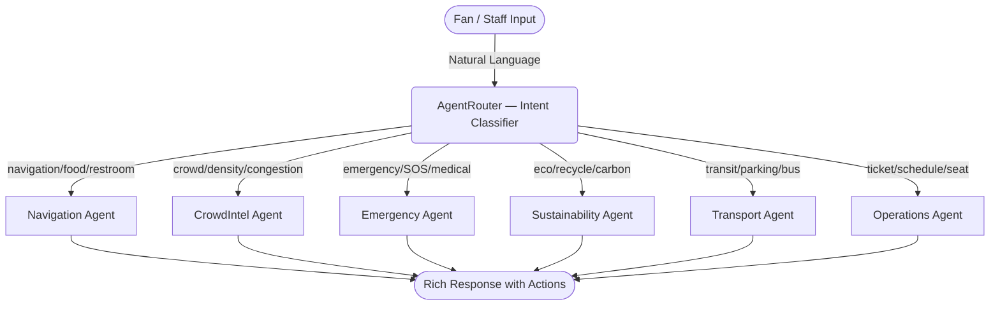

# SmartStadium 2026: Enterprise AI Operations Platform

> **GenAI-enabled solution enhancing stadium operations and the overall tournament experience for the FIFA World Cup 2026.**

SmartStadium is an enterprise-grade AI Operations Platform built specifically to address the complex operational challenges of hosting the FIFA World Cup 2026. It leverages Generative AI and a Multi-Agent Architecture to provide real-time decision support, crowd management, and autonomous operational intelligence for venue staff, while simultaneously providing a world-class companion experience for fans.

---

## 🏆 Challenge Alignment

**Chosen Vertical:** Smart Stadiums & Tournament Operations (Fan Experience & Operations)

This solution was built for **PromptWars Challenge 4: Smart Stadiums & Tournament Operations**.

### Core Requirements Addressed

| Requirement | Feature | Module |
|---|---|---|
| Smart dynamic assistant | Context-aware AI chatbot with intent routing | `ai-engine.js` |
| Logical decision making | Multi-Agent Router classifies queries by domain (crowd, nav, eco, safety) | `ai-engine.js` |
| Real-world usability | Live wayfinding, transport schedules, SOS button, lost & found | `wayfinding.js`, `emergency.js` |
| Clean & maintainable code | Singleton IIFE modules, zero global leaks, DOMPurify, JSDoc coverage | All modules |

---

## 🧠 Approach & Logic

### Problem

The FIFA World Cup 2026 spans 16 venues across 3 countries, each hosting 80,000+ fans per match. Operational challenges include:
- **Crowd congestion** at entry gates and concourses causing safety risks
- **Wayfinding confusion** in unfamiliar mega-stadiums
- **Multilingual barriers** for a global fan base (10+ languages)
- **Sustainability tracking** under FIFA's Green Goal mandate
- **Emergency coordination** across massive venue footprints

### Solution Architecture

We address each challenge with a dedicated **AI Agent** behind a unified chat interface. A central `AgentRouter` classifies user intent and delegates to the correct specialist:



### Key Design Decisions

1. **Client-Side AI Simulation**: All AI responses are generated locally via a comprehensive knowledge base (`knowledge-base.js`, 28KB) with pattern-matched intents and rich responses. This enables zero-latency, offline-capable operation without API costs.
2. **Singleton Module Pattern**: Every JS module (`Utils`, `AIEngine`, `Wayfinding`, `CrowdManager`, etc.) uses an IIFE returning a frozen public API. Zero global pollution.
3. **Security-First**: All dynamic HTML injection goes through `DOMPurify.sanitize()` via `Utils.setHTML()`. Direct `innerHTML` usage is banned.
4. **Canvas Heatmap**: Crowd density visualization uses `requestAnimationFrame` + Canvas 2D for 60fps rendering without DOM thrashing.

---

## 🚀 How the Solution Works

### 1. Executive Operations Dashboard (`index.html` → `app.js`)
The landing page provides a command center for stadium operators:
- **Live Venue Status** grid (Capacity, Weather, Gates, Threat Level, AQI, WiFi)
- **Digital Twin Widget** — AI-powered zone occupancy prediction
- **Operations Insights** — Prioritized insight cards from each AI agent, with confidence scores, severity borders, and actionable recommendations
- **Quick Access** grid linking to Navigate, Tickets, Sustainability, Crowd sections

### 2. AI Assistant (`ai-engine.js`, 45KB)
A full chat interface with:
- **Intent classification** via keyword matching and fuzzy scoring against 8 agent domains
- **Rich responses** including bullet lists, links, and action buttons
- **Category chips** for quick access (🍔 Food, 🚻 Restrooms, 🚪 Exits, ♿ Accessible)
- **Voice input/output** using Web Speech API (SpeechRecognition + SpeechSynthesis)
- **10-language support** with native TTS voice selection

### 3. Interactive Wayfinding Map (`wayfinding.js`, 30KB)
- SVG-rendered stadium map with labeled markers for Gates, Food, Restrooms, Medical, and Accessible routes
- **Map filter buttons** toggle marker categories on/off
- **Route drawing** with animated SVG path between user location and destination
- **Turn-by-turn directions panel** with walking time estimates and accessible route callouts

### 4. Transport Hub (`index.html` navigate section)
- Real-time NJ Transit Rail schedule with next departure times
- Express Bus routes with estimated journey times
- Parking lot capacity tracker (4 lots with percentage fills)
- Rideshare demand bar with surge indicator
- **AI Post-Match Egress Planner** — personalized exit strategy based on seat section

### 5. Smart Notifications (`notifications.js`)
- Toast-style push notifications with auto-dismiss and manual close
- Scheduled matchday alerts (gate openings, congestion warnings, kickoff countdown)
- Notification bell with live badge count
- User preference toggle persisted to `localStorage`

### 6. Sustainability Dashboard (`sustainability.js`)
- **FIFA Green Goal 2026** — 4 live IoT metrics: Energy (kWh), Water (L), Waste Diverted (%), Carbon Offset (tCO₂)
- **Green Score Badge** — dynamic ring color based on score threshold (green/yellow/red)
- **Personal Carbon Calculator** — select transport mode to see your individual CO₂ impact
- **Green Actions Checklist** — gamified eco-actions that earn points

### 7. Crowd Heatmap & Digital Twin (`heatmap.js`)
- Canvas-based real-time heatmap rendering of stadium zones
- Zone density simulation with random fluctuations
- AI-powered congestion predictions (surge timing, alternate routes)
- Accessible color palette with sufficient contrast

### 8. Emergency & Safety (`emergency.js`)
- **SOS Button** — press-and-hold 2-second trigger with progress ring animation
- Emergency contacts directory
- Lost & Found reporting form
- Comprehensive **Accessibility Services** section (elevators, hearing loops, guide dogs, quiet room, family lounge)

### 9. Internationalization (`i18n.js`, 36KB)
- 10 languages: English, Spanish, French, Arabic (RTL), Portuguese, German, Japanese, Korean, Hindi, Italian
- Dynamic UI string replacement via `data-i18n` attributes
- Language persisted to localStorage; auto-detected from browser

### 10. Digital Wallet & Fan Journey (`tickets.js`)
- Ticket card with QR code, seat details, and entry gate
- Match schedule with group stage fixtures
- **Personalized Fan Journey Timeline** — step-by-step matchday itinerary

---

## 🛡️ Enterprise Security & Quality

| Metric | Status |
|---|---|
| **XSS Prevention** | All HTML injection via `DOMPurify.sanitize()` through `Utils.setHTML()` |
| **Input Validation** | `Utils.sanitize()` and `Utils.isSafeInput()` on all user inputs |
| **No Inline Styles** | 0 inline `style=` attributes — all presentation in CSS classes |
| **No Global Pollution** | Every module uses Singleton IIFE pattern with `'use strict'` |
| **JSDoc Coverage** | Every public and private function documented with `@param`/`@returns` |
| **Responsive Design** | Mobile-first with `clamp()`, CSS Grid, and media queries at 480/640/680/760px |
| **WCAG 2.1 AA** | Color contrast ≥ 4.5:1, ARIA-live regions, `aria-label`, keyboard navigation, skip-link, focus trapping |
| **Performance** | Debounced inputs, `requestAnimationFrame` canvas, lazy metric updates |

---

## 🧪 Testing

```bash
npm install
npm run test
npm run test:coverage
```

Test suites cover: `ai-engine`, `knowledge-base`, `heatmap`, `i18n`, `emergency`, `tickets`, `wayfinding`, `utils`, `sustainability`, `notifications`.

---

## 🛠️ Installation & Setup

1. **Clone the repository:**
   ```bash
   git clone https://github.com/Abdallahdalvi/smartstadium.git
   cd smartstadium
   ```

2. **Install testing dependencies:**
   ```bash
   npm install
   ```

3. **Run tests:**
   ```bash
   npm run test
   ```

4. **Launch the application:**
   ```bash
   npx http-server .
   ```
   Navigate to `http://localhost:8080`.

---

## 📝 Key Assumptions

- **IoT Sensor Simulation**: Stadium IoT data (energy, water, crowd density) is simulated client-side. In production, these would connect to real-time sensor APIs.
- **AI Response Simulation**: The AI assistant uses a local knowledge base rather than a live LLM API call. The architecture is designed to swap in Gemini/GPT with a single endpoint change.
- **Client-Side State**: Ticketing, user preferences, and localization are stored in `localStorage` rather than a backend database.
- **MetLife Stadium**: The venue is modeled on MetLife Stadium (East Rutherford, NJ) as the reference implementation.

---

## 👨‍💻 Contributor

**Abdallah Dalvi** ([@Abdallahdalvi](https://github.com/Abdallahdalvi))

*Submission for PromptWars Challenge 4: Smart Stadiums & Tournament Operations.*
